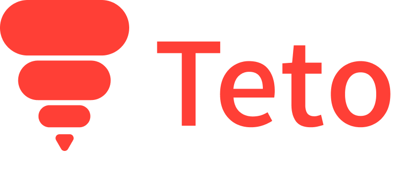

# Teto



Teto is a APL Inspired programming language with a prefix syntax and symbols that fit on your keyboard. The following is an example of Teto's syntax

You can download the Teto Interpreter on the release tab.

  

## Understanding Teto

The following is a code in Teto:

```

> + * 2 |23

=> 552.0

```

This code example can be read like this, in infix form, as an example:

```

foldl (+) 0 (map (*2) [1..23])

```

Teto treats arrays differently from most languages, giving operands a way to work directly with arrays. For example, a `number * array` will map each element of the array times the number. But an `array * number` will give that array multiplied `number` times.

```

* 3 [1,2,3]

[3.0, 6.0, 9.0]

  

* [1,2,3] 3

[[1.0, 2.0, 3.0], [1.0, 2.0, 3.0], [1.0, 2.0, 3.0]]

```

You can say that operations with numbers and arrays happen in a more "logical form". Please have fun trying out different combinations to see how they work!

  

## Functions in Teto

Teto has the following functions mapped to special characters, depending on the order you use them - in a Vectorial or a Numeric data type, their behavior may change a bit:

###  Range ( | )
Creates a list withing a range. 
`(|5) -> [1.0,2.0,3.0,4.0,5.0]`

###  Maximum ( " )
Gets the maximum element of a list.
`("[3,5,7,3,1]) -> 7.0`

###  Minimum ( " )
Gets the maximum element of a list.
`('[3,5,7,3,1]) -> 1.0`

###  Factorial ( ! )
Gets the factorial of a number.
`!5 -> 120.0`

###  Negate ( ¬ )
Negates a number.
`¬5 -> -5.0`

###  Exponent ( ^ )
Gets the exponent of a number.
`^5 2 -> 25.0`

###  Identity ( ° )
Gets the identity element (the element itself).
`°5 -> 5.0`

###  Reverse ( § )
Reverses a list.
`§ [5,4,3,2,1] -> [1.0,2.0,3.0,4.0,5.0]`

###  Rotate ( @ )
Rotates a list.
`@ 2 [5,4,3,2,1] -> [3.0, 2.0, 1.0, 5.0, 4.0]`

###  Index ( # )
Gets an Element from a passed index.
`# 2 [5,4,3,2,1] -> 4.0`

###  Match ( & )
Gets the index of the first element that matches an expression.
`&  3 [5,4,3,2,1] -> 3.0`

___
Teto is still a work in progress and it's just a hobbie project made for fun. The quality of the interpreter's code is pretty bad, but if you are interested in helping, feel free to do so!
